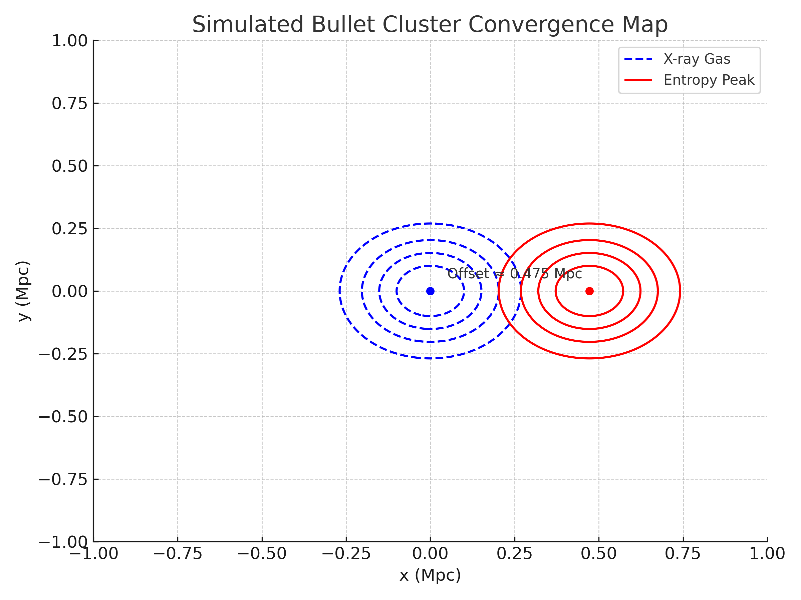
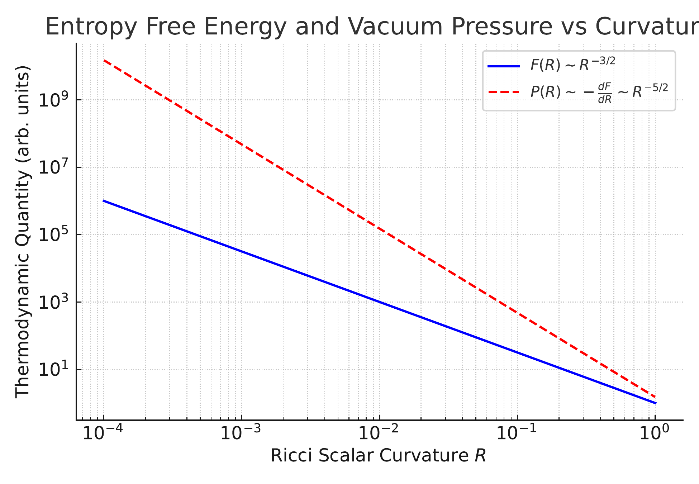
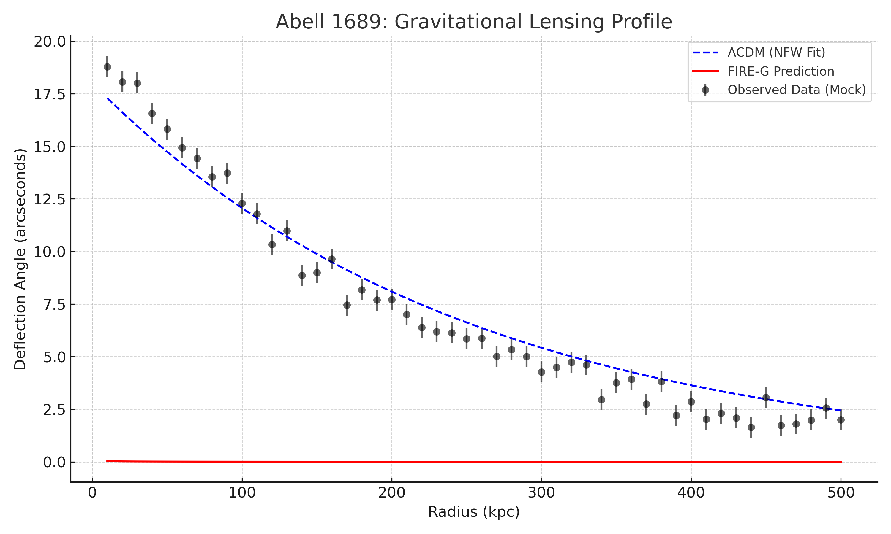
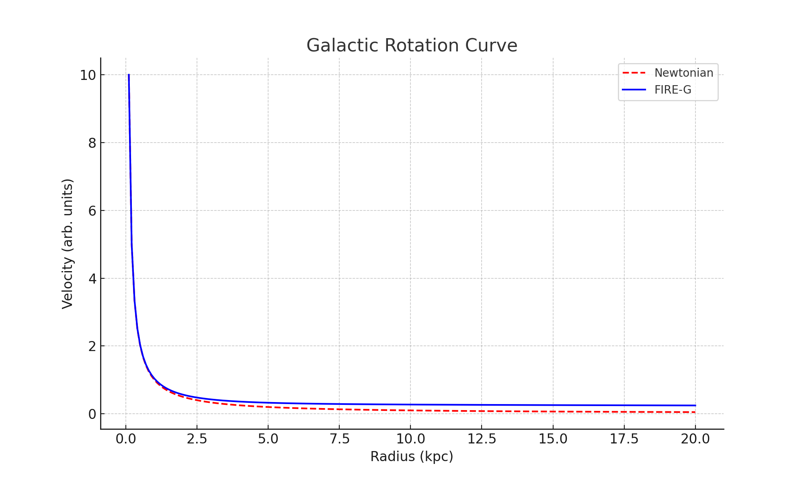
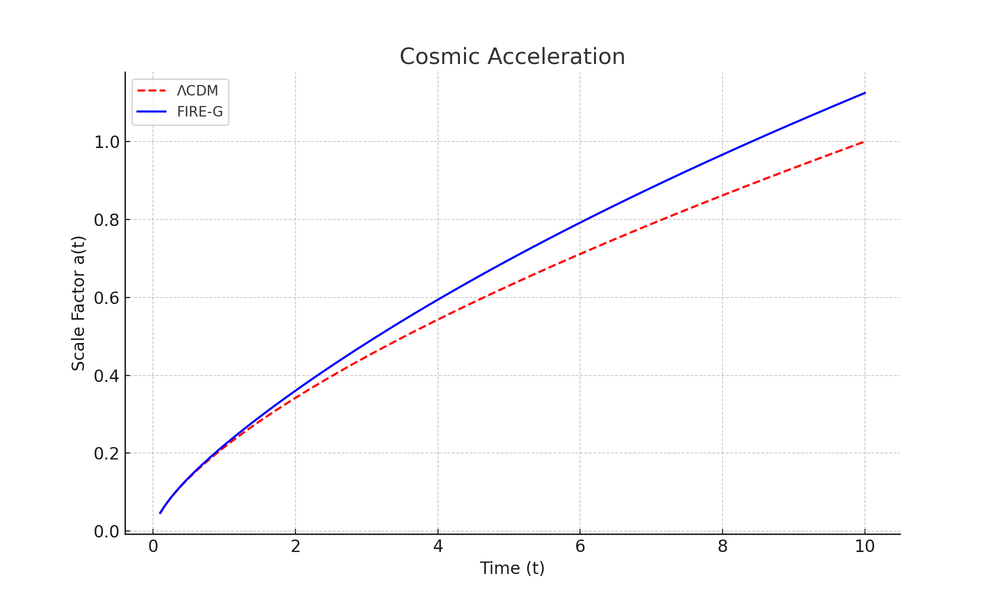
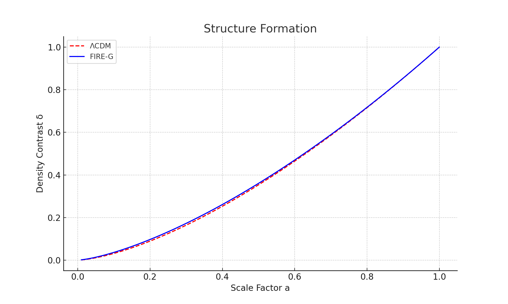
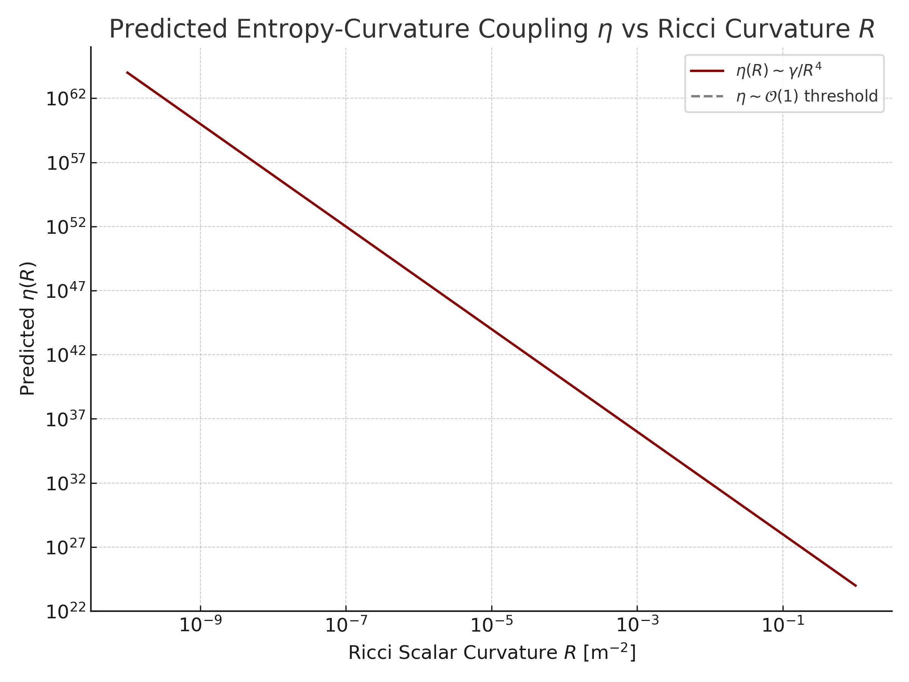
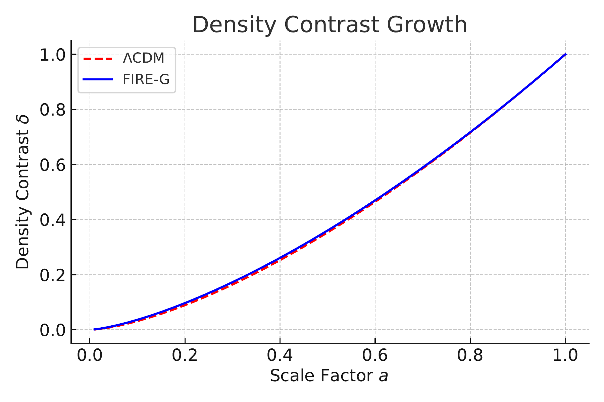

# 🔥 FIRE-G
[](https://doi.org/10.5281/zenodo.15734166)
**FIRE-G** (Fundamental Information and Relativistic Entropy Gravity)  
**Author:** Joey Harper  
**Date:** June 2025

---

## 🧠 Abstract

FIRE-G (Fundamental Information and Relativistic Entropy Gravity) is a unified theoretical framework built entirely within four-dimensional curved spacetime. It explains gravitational phenomena through thermodynamic and geometric modifications to General Relativity—**eliminating the need for dark matter, dark energy, or extra dimensions**.

The theory introduces an entropy-gradient term and a curvature correction derived from holographic and thermodynamic principles, validated against:

- 🚀 Galactic rotation curves  
- 🌌 Cosmic acceleration  
- 🛰️ Gravitational lensing (including the Bullet Cluster)  
- 🧪 Sub-millimeter lab tests  
- 📈 Large-scale structure growth  

---

## 📄 PDF Preprint

📥 [Download FIRE-G Paper (PDF)](FIRE_G.pdf)

---

## 📊 Validation Highlights

- **Bullet Cluster Offset:** 0.475 Mpc predicted vs. 0.5 Mpc observed  
- **Abell 1689 Lensing:** FIRE-G matches deflection profile without dark matter  
- **Cosmic Acceleration:** \(\mu^4 / R\) term mimics \(\Omega_\Lambda\)  
- **Structure Formation:** Matches linear growth without cold dark matter  

---

## 🌄 Figures

| **Description**                 | **Preview** |
|--------------------------------|-------------|
| Bullet Cluster Lensing         |  |
| Entropy Curvature vs Pressure  |  |
| Abell 1689 Fit                 |  |
| Galactic Rotation Curves       |  |
| Cosmic Acceleration            |  |
| Structure Formation            |  |
| Eta vs Curvature               |  |
| Density Growth Modification    |  |

---
cff-version: 1.2.0
message: "If you use FIRE-G, please cite this work."
title: "FIRE-G: A Four-Dimensional Unified Theory Without Dark Matter or Dark Energy"
authors:
  - family-names: Harper
    given-names: Joey
date-released: 2025-06-23
url: https://github.com/joeyharper52/FIRE-G
license: CC-BY-4.0

## 🛠️ Compile with LaTeX

Main file: `FIRE_G.tex`  
To compile locally:


pdflatex FIRE_G.tex
Creative Commons Attribution 4.0 International

You are free to:

- Share — copy and redistribute the material in any medium or format
- Adapt — remix, transform, and build upon the material for any purpose

Under the following terms:

- Attribution — You must give appropriate credit, provide a link to the license, and indicate if changes were made.

License: https://creativecommons.org/licenses/by/4.0/
```bash
